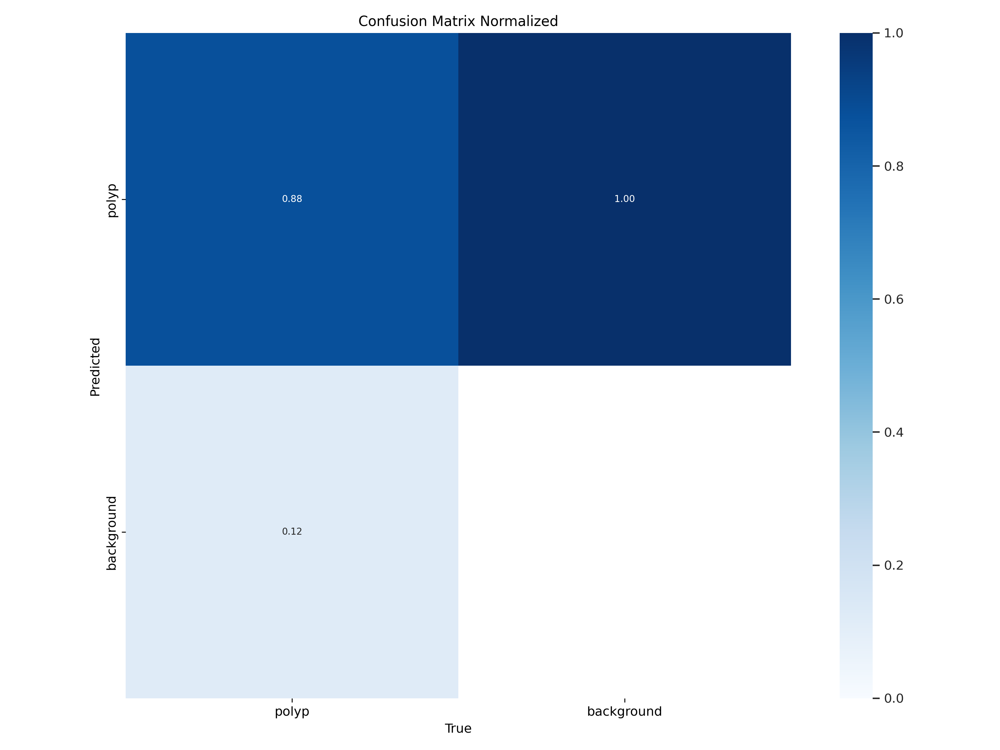
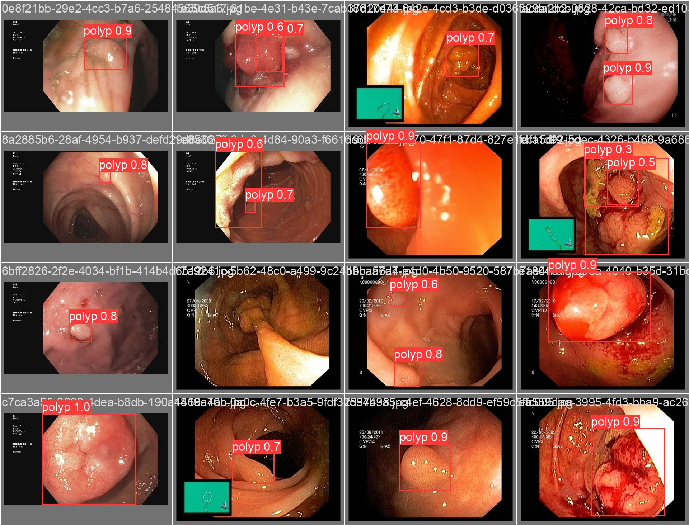
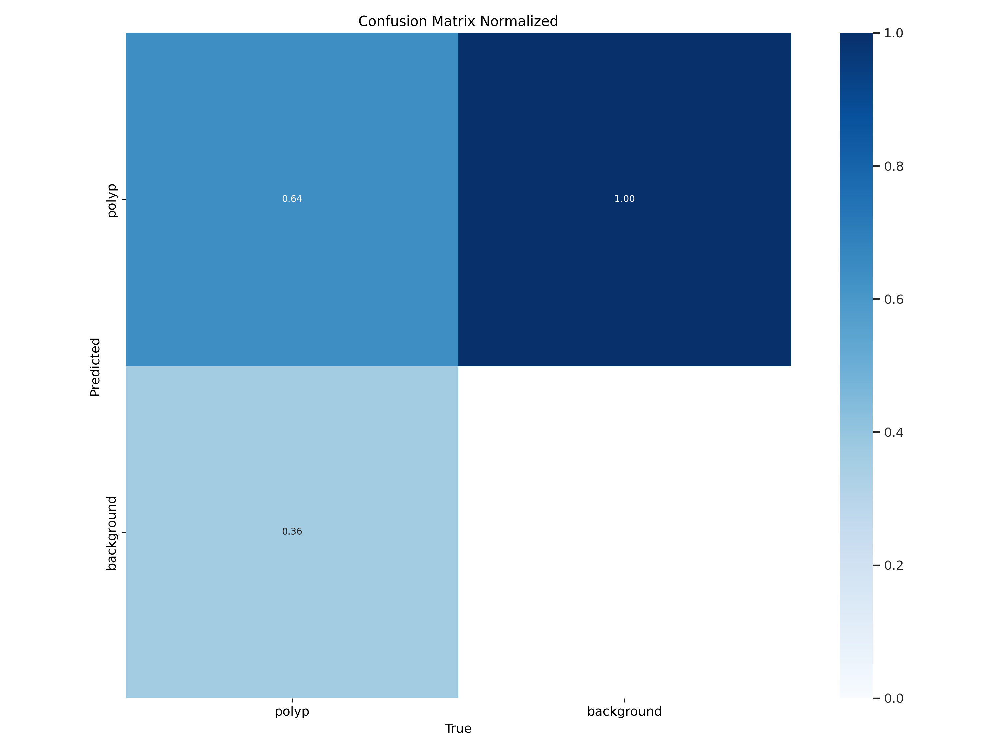

# Polyp detection 

In this repo, we are going to employ Machine learning methods to detect
colon tissues(polyp).

## YOLOv9-FineTune: [PolypDB](https://arxiv.org/abs/2409.00045)
- Train
```markdown
YOLOv9m summary (fused): 151 layers, 20,013,715 parameters, 0 gradients, 76.5 GFLOPs
                 Class     Images  Instances      Box(P          R      mAP50  mAP50-95)
                 all        359        382      0.933      0.912      0.963      0.816
```
- detect polyps(bounding box) 
<p align="center">
    
    
</p>

## MambaYOLO-Train 

Mamba-YOLO merges the **state-space modeling efficiency of Mamba** with the **real-time detection strength of YOLOv8**.  
The architecture replaces the CSP backbone with a **Selective Scan (Mamba) block**, enabling long-range spatial dependency modeling at reduced computational cost.

This implementation targets **medical image analysis**, specifically **polyp detection** from multimodal colonoscopy datasets.

---

### Architecture

| Component | Description |
|------------|--------------|
| **Backbone** | Mamba-based state-space selective scan layers replacing CSP blocks |
| **Neck** | PANet-style feature pyramid |
| **Head** | YOLOv8 detection head (multi-scale anchors) |
| **Losses** | CIoU + BCE + objectness loss |
| **Training Framework** | Ultralytics YOLO API |
| **Hardware** | NVIDIA T4 (16 GB) × 2 |
| **Software Stack** | PyTorch 2.3.1 + CUDA 12.1, Python 3.11 |

---

### Training Methodology
| Parameter       | Value            |
| --------------- | ---------------- |
| Modality          | WLI              |
| Epochs          | 300              |
| Batch size      | 16               |
| Optimizer       | AdamW            |
| Image size      | 640×640          |
| Scheduler       | Cosine annealing |
| Mixed precision | AMP enabled      |

<p align="center">
    
</p>

### Inference: WLI(Training modality)
<p align="center">
    
</p>
<p align="center" style="display: flex; flex-direction: row ;gap: 4%">
  
  
  <figcaption style="text-align: center;">GroundTruth/Prediction on WLI</figcaption>
</p>

### Inference: NBI-LCI-FICE-BLI
<p align="center">
    
</p>
<p align="center" style="display: flex; flex-direction: row ;gap: 4%">
  
  
  <figcaption style="text-align: center;">GroundTruth/Prediction on NBI-LCI-FICE-BLI</figcaption>
</p>