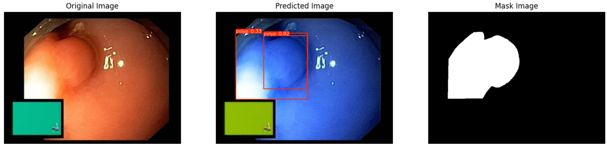

# Polyp detection 

In this repo, we are going to employ Machine learning methods to detect
colon tissues(polyp).

## YOLOv9-FineTune: [PolypDB](https://arxiv.org/abs/2409.00045)
- Train
```markdown
YOLOv9m summary (fused): 151 layers, 20,013,715 parameters, 0 gradients, 76.5 GFLOPs
                 Class     Images  Instances      Box(P          R      mAP50  mAP50-95)
                 all        359        382      0.933      0.912      0.963      0.816
```
- detect polyps(bounding box) 
<p align="center">
    
    
</p>

